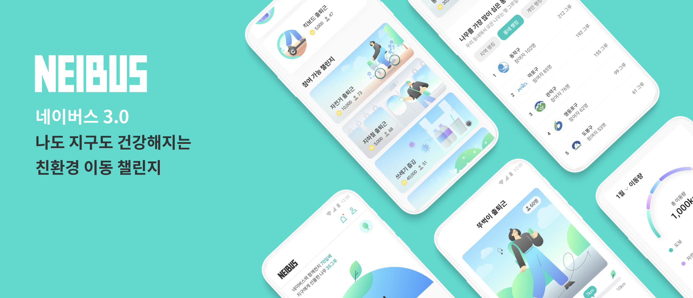
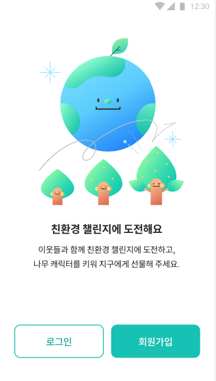
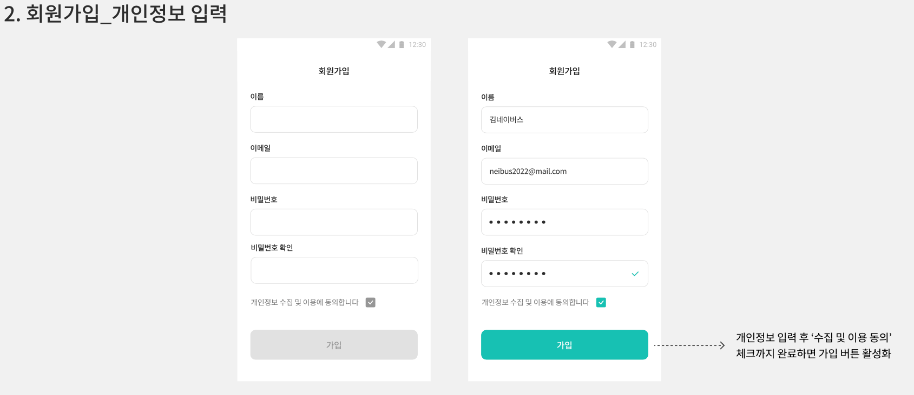
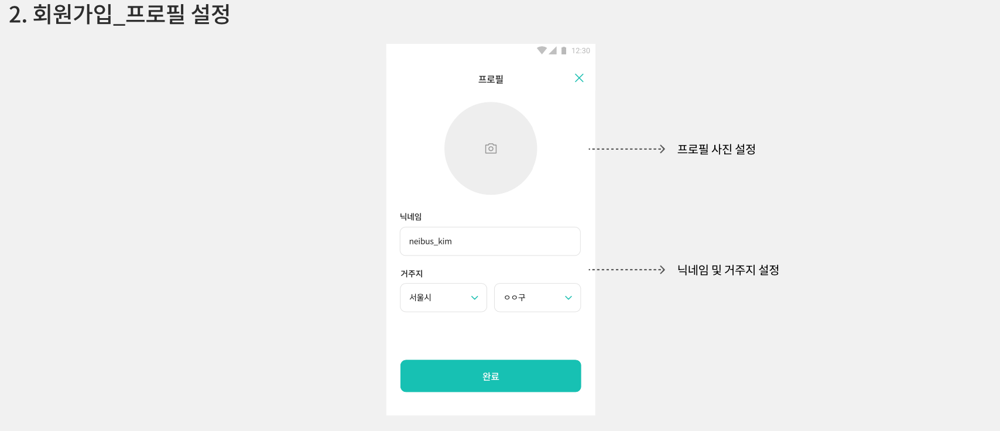
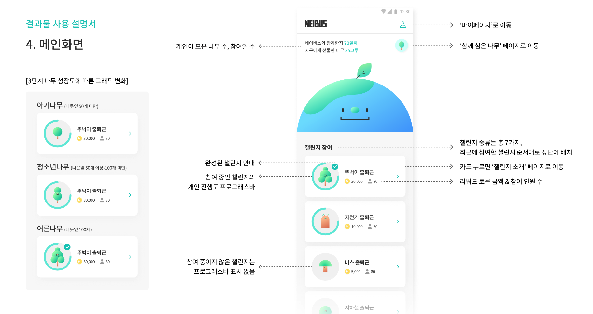
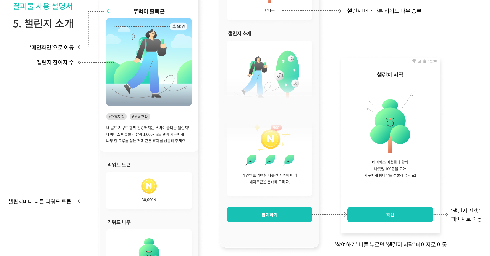
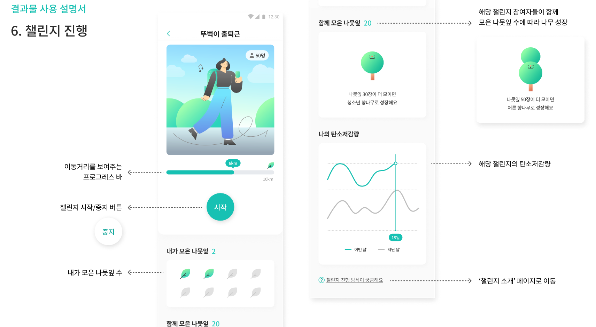
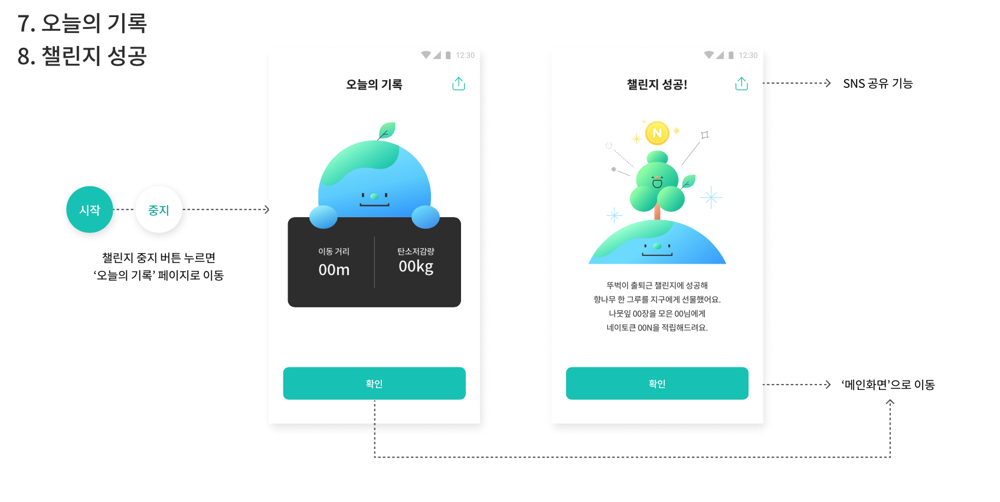
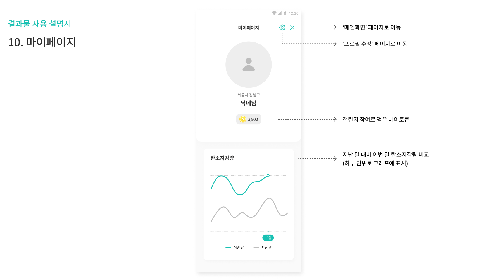
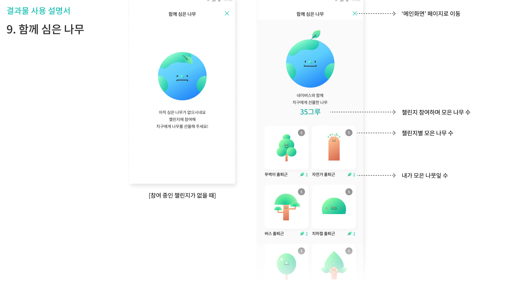

# NEIBUS 3.0 친환경 이동 챌린지 

## 🙋‍♂️ 서비스 기획 의도 
> 자가용이 아닌 대중교통/퍼스널 모빌리티/도보 이동에 대한 탄소 배출 저감량 및 소나무 식재 효과 등 친환경 통계를 유저에게 제공하고, 리워드를 제공함으로서 금전적 혜텍을 제공하는 단계에서 나아가 친환경 라이프 스타일에 동참하는 심리적 만족감을 제공하는 서비스 

## 💎 서비스 미리 보기 

온보딩

회원가입 개인정보 입력

회원가입 프로필

메인 화면

챌린지 소개

챌린지 진행

챌린지 기록

마이 페이지

함께 심은 나무 정보 확인

## 📚 더 자세히 알아보기 
[배포 링크](http://15.164.98.50/)

[Notion 문서](https://quickest-asterisk-75d.notion.site/KDTxSeSAC-_2-0358c7a759364cf7ad4499cf38e99afb)

